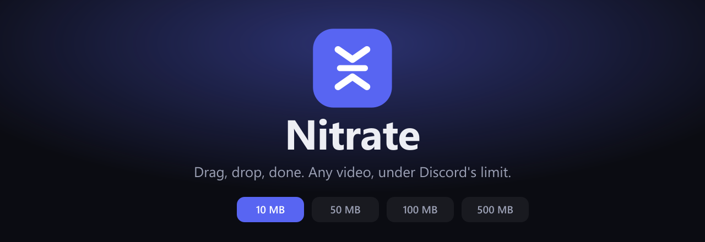
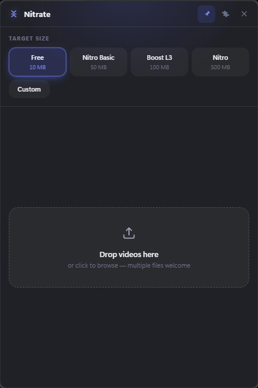
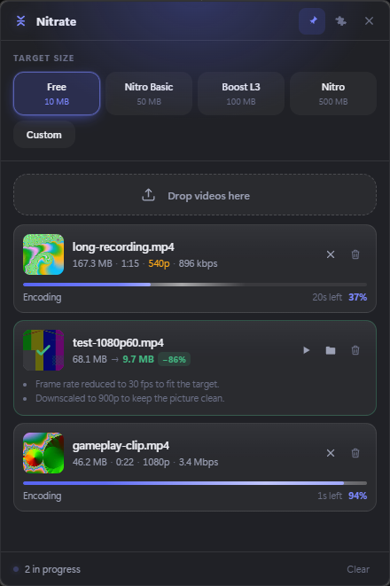
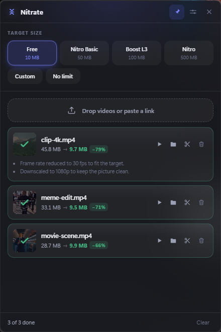
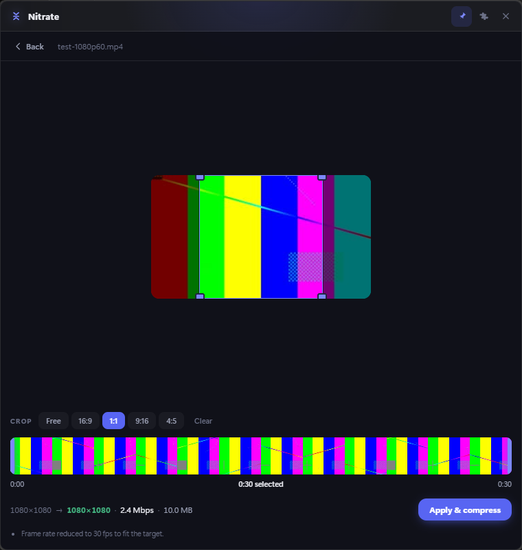
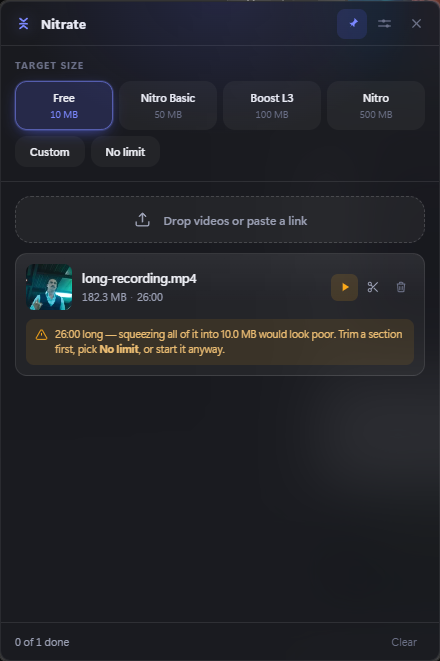
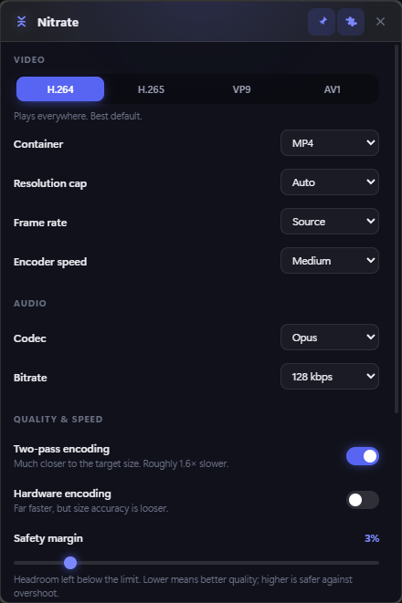

**Discord won't take your video? Drop it here.**

Nitrate sits in your system tray. Click the icon, drop in a video — or paste a
link — and it comes back in your Downloads folder small enough to send, without
paying for Nitro.

Free, and everything happens on your own computer.

### [⬇ Download for Windows](https://github.com/BeeeFX/Nitrate/releases/latest)

---

## See it

<table>
<tr>
<td width="33%" valign="top">

<b>Pick a size, drop a file</b>

</td>
<td width="33%" valign="top">

<b>Every file, its own progress</b>

</td>
<td width="33%" valign="top">

<b>45.8 MB → 9.7 MB</b>

</td>
</tr>
</table>

## What it does

- **Drop in as many videos as you like.** Each one gets its own progress bar and
  time remaining, and they carry on in the background while you do something
  else.
- **Or paste a link.** Copy a YouTube, X, Instagram, Reddit or Twitch address,
  press <kbd>Ctrl</kbd>+<kbd>V</kbd>, and it downloads the video and compresses
  it. There's no URL box to hunt for — the drop zone is the place things go.
- **It hits the size you asked for.** Pick 10 MB and you get something around
  9.7 MB, not an 11 MB file that Discord bounces back.
- **It keeps the picture watchable.** Rather than smearing a long 4K clip into an
  unwatchable 10 MB, it lowers the resolution and frame rate until there's
  genuinely enough detail left, and tells you what it did.
- **It leaves alone what already fits.** A file that's already under the limit is
  passed through untouched, because re-encoding it could only make it worse.
- **Or ignore the limit.** Choose **No limit** and it simply compresses well,
  showing you an estimate of the size you'll end up with.
- **Nothing is uploaded.** Every frame is processed on your own machine, and
  nothing is sent anywhere.
- **It stays out of the way.** Finished files land in your Downloads folder.
  Close the window and it waits quietly in the tray.

You can also right-click any video and pick **Open with Nitrate**, or drop one
onto the shortcut, and it starts straight away.

## Cut out the bit you want

<table>
<tr>
<td width="55%" valign="top">

</td>
<td valign="top">

The scissors button on any video opens an editor.

Drag a box over the picture to crop it — freehand, or locked to 16:9, 1:1, 9:16
or 4:5 — and drag the handles under the filmstrip to choose where the clip starts
and ends.

**Watch the line at the bottom while you drag.** Trimming and cropping both buy
you quality: cut a ten-minute clip down to thirty seconds and the same 10 MB
stretches roughly twenty times further, so the video comes out sharper. It shows
the resolution you'll actually get, in green when nothing has to be given up and
amber when it does.

The size and quality settings live in here too, so you always know what you're
about to get before you press **Compress**.

</td>
</tr>
</table>

## Long videos wait for you

<table>
<tr>
<td width="46%" valign="top">

</td>
<td valign="top">

Anything over twenty minutes doesn't start compressing on its own.

Squeezing half an hour into 10 MB is a long wait for something unwatchable, and
it's usually not what you meant — normally you wanted one moment out of it. So it
says so, and offers you three ways on: trim a section, switch to **No limit**, or
go ahead anyway.

Pasted links still download as normal. It's only the compressing that waits, so
you arrive in the editor with the video already there.

</td>
</tr>
</table>

## Settings

<table>
<tr>
<td width="46%" valign="top">

</td>
<td valign="top">

It works out of the box, but everything is there if you want it:

| | |
| --- | --- |
| **Size** | A Discord tier, a size you type, or **No limit** |
| **Quality** | Smallest, balanced or high |
| **Video format** | H.264, H.265, VP9, AV1 |
| **Resolution / frame rate** | Automatic, or capped by hand |
| **Sound** | AAC, Opus, keep as-is, or none |
| **Two-pass** | Lands closer to the target, takes a bit longer |
| **Use my graphics card** | Much faster, slightly less precise |
| **Where files go** | Downloads by default |
| **Pasted links** | Start automatically, and what quality to fetch |
| **Start with the computer** | Waiting in the tray when you sign in |

</td>
</tr>
</table>

## Installing

Download the installer from
[Releases](https://github.com/BeeeFX/Nitrate/releases/latest) and run it. It
installs just for you, so Windows won't ask for an administrator password.

> **Windows will warn you the first time.** The app isn't code-signed — a
> certificate costs a few hundred pounds a year, which is hard to justify for a
> free tool. Click **More info → Run anyway**.

Once installed, it keeps itself up to date: when a new version appears you get a
banner offering to update, and if something is still compressing it waits until
the queue is finished before restarting.

Windows only at the moment.

## Browser extension

A **Send to Nitrate** button, right on the page — on YouTube, X, Instagram,
Reddit and Twitch — plus a right-click entry that works on any link anywhere.

> ### ⏳ In review
>
> The extension is with the **Chrome Web Store** and **Firefox Add-ons** at the
> moment, waiting to be approved. **Install links will be posted here as soon as
> they're through.**
>
> Nothing else is needed — the app already understands everything the extension
> sends, so it'll work the moment the extension lands.

It can't read the pages you visit and collects nothing at all; all it does is
hand an address to the app. In the meantime, copying a link and pressing
<kbd>Ctrl</kbd>+<kbd>V</kbd> in Nitrate does the same job with one extra step.

## Questions

**Does anything get uploaded?** No. The video never leaves your computer.

**Do I need Nitro?** No — that's the point.

**Will it wreck the quality?** It aims for the best picture the size allows, and
tells you when it has had to lower the resolution to get there. If the file
already fits, it doesn't touch it at all.

**Is it really free?** Yes, and the source is here for anyone to read.

## For developers

Building from source, how the size targeting works, the project layout and the
release process are all in
[docs/DEVELOPING.md](docs/DEVELOPING.md).

## Licence

Nitrate's own source is MIT. The released builds bundle GPL v3 ffmpeg builds, and
pasting a link fetches [yt-dlp](https://github.com/yt-dlp/yt-dlp) on demand. See
[THIRD-PARTY.md](THIRD-PARTY.md).

Not affiliated with Discord. "Discord" and "Nitro" are trademarks of Discord Inc.
